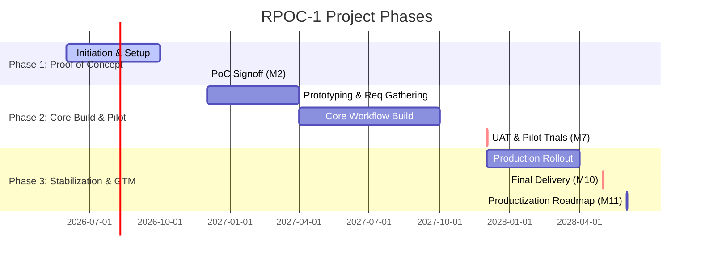

# RPO Compliance Control Tower (RPOC - 1) — Project Charter Analysis

This document provides a comprehensive analysis and breakdown of the **RPO Compliance Control Tower** (Project Code: `RPOC - 1`) project charter. It covers the business background, operational challenges, project governance, structural phases, system architecture, and details of the n8n.io proof-of-concept workflows.

---

## 📌 Executive Summary & Context

* **Project Code**: `RPOC - 1`
* **Project Name**: R&O Compliance Control Tower
* **Client / Org**: Blueera Technologies INC
* **Document Status**: Management Review Draft (Dated Dec 20, 2025)
* **Onshore Tech Lead**: Srilatha Rayani
* **Budget**: $425,000.00 estimated over 24 months (Authorized range: $250k - $500k; initial allocation: $150k).
* **Delivery Model**: Agile methodology across a 24-month schedule (June 2026 – June 2028).

> [!NOTE]
> The primary business goal is to solve operational risks in workforce staffing (e.g. employee onboarding, work authorizations, LOA, payroll readiness, and payment disputes) by moving from fragmented, manual tools (spreadsheets, email approvals) to a unified, workflow-driven service management system.

---

## 🎯 Project Goals & Scope

### Core Functional Modules
1. **RPOC - 1 Portal**: A role-based internal portal for HR/ERM, payroll, accounting, recruiting, management, and tech support.
2. **Employee Lifecycle Record Center**: Central repository for candidate transitions, onboarding, work authorizations, and offboarding.
3. **Payroll Readiness Workflow**: Checklists and approvals for visa status, leave-of-absence (LOA), direct deposit, and state registration.
4. **Document Control Module**: Automated document numbering and approvals for offer/experience letters.
5. **Management Authorization Workflow**: Formal audit trails for management sign-off on operations.
6. **Payment Dispute Communication Log**: Dispute tracking, documentation, and final resolutions.
7. **Risk / Compliance Dashboard**: Real-time tracking of overdue compliance items and payroll holds.
8. **Audit Evidence Repository**: Secure, centralized collection of evidence for audits.

### Scope Demarcation
* **In-Scope**: Architecture design, workflow configuration, portal UI, API integrations (Microsoft 365/SharePoint, HR/Accounting tools), testing, training, and a post-go-live support framework.
* **Out-of-Scope**: Custom payroll engine build, replacing core accounting software, legal/immigration advice generation, or unapproved third-party writes.

---

## 📅 Roadmap & Milestones

The project runs over **24 months** through three distinct phases:



---

## 📐 System Architecture

Section 4.6 details the information flow, operational processes, and environments of the RPOC tower.

### 4.6.1 Information Flow
This diagram details the connection between input sources, the control tower's backend workflows, data storage, and the resulting audit trails/management dashboards.


_Figure 4.6-1: RPO Compliance Control Tower - Information Flow Diagram_

### 4.6.2 End-to-End Operational Workflow
Depicts the business journey from candidate intake to compliance review, management approval, exception handling, payroll checkoffs, and dispute resolution.


_Figure 4.6-2: RPO Compliance Control Tower - End-to-End Operational Workflow_

### 4.6.3 Software Architecture Layers
Details the platform layers: User Access (Portals/Catalogs), Workflow Automation, Data/Records (Audit History), Integration (REST/SOAP APIs to SharePoint/HR Tools), and Dashboards (Executive/GRC).


_Figure 4.6-3: RPO Compliance Control Tower - Software Architecture_

### 4.6.4 Infrastructure & Multi-Environment Delivery Model
Outlines the physical infrastructure supporting development, including developer endpoints, the security layer (MFA/SSO/VPN), and the tiered environment setup (DEV, TEST/QA, PROD) with an integration MID Server.


_Figure 4.6-4: RPO Compliance Control Tower - Infrastructure & Environment Architecture_

---

## ⚡ Appendix D: n8n.io POC Workflow Demonstration

The document includes screenshots detailing the functional prototype constructed on **n8n.io** (cloud instance `arwinrai.app.n8n.cloud`). This flow automates the candidate offer-letter generation, approval routing, document PDF generation, candidate notification (via email and WhatsApp), and candidate e-signature response processing.

> [!TIP]
> The POC uses email-based URL actions for candidate approval, avoiding expensive external document signing APIs and keeping data directly within the local compliance log.

### Step-by-Step Walkthrough of the n8n POC Flow
Use the carousel below to view the progression of the n8n.io automated offer flow:

````carousel

<!-- slide -->

<!-- slide -->

<!-- slide -->

<!-- slide -->

<!-- slide -->

<!-- slide -->

````

---

## 🔍 Critical Analysis & Observations

1. **Strategic Transition Path**: The charter establishes a path starting with low-cost tools (JSM/Freshservice/n8n.io) in Phase 1 and migrating to a production-grade enterprise system (ServiceNow) in Phase 2. The active n8n.io POC validates the core logic before licensing and environment costs are incurred.
2. **Resource Alignment**: The Resource Plan names **Srilatha Rayani** as the Onshore Technical Lead. She will own the conversion of these requirements and the n8n POC structures into the target enterprise architecture.
3. **Productization Blueprint**: Appendix C details how the internal Control Tower can be packaged into reusable modules (e.g., Compliance Dashboard, Dispute Log, LOA Tracker) to serve external clients in the consulting and workforce operations sectors.
