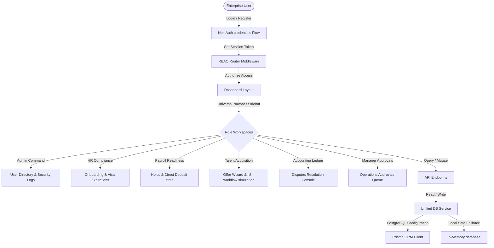

# Walkthrough: Modern Enterprise Workforce Management Web App

We have successfully designed and built a modern, premium enterprise workforce compliance management web application (inspired by ServiceNow and the RPO Compliance Control Tower). 

---

## Technical Architecture Overview

Here is a visual map of the information flow and software layers we created:



---

## 🔑 Developer Seed Accounts (Quick Login)

Default accounts are seeded for all 6 roles. You can log in using the credentials below, or click any button in the **Quick Role Login** panel on the login screen to sign in instantly:

| Role | Username (Email) | Password | Default Department & Job |
| :--- | :--- | :--- | :--- |
| **Admin** | `admin@enterprise.com` | `password123` | Tech Operations • Onshore Technical Lead |
| **HR** | `hr@enterprise.com` | `password123` | HR Operations • HR Specialist |
| **Payroll** | `payroll@enterprise.com` | `password123` | Payroll Operations • Payroll Specialist |
| **Recruiter** | `recruiter@enterprise.com` | `password123` | Recruiter Operations • Recruiter Specialist |
| **Accounting** | `accounting@enterprise.com` | `password123` | Accounting Operations • Accounting Specialist |
| **Manager** | `manager@enterprise.com` | `password123` | Manager Operations • Manager Specialist |

---

## 📁 Key File Definitions

### 1. Database Schema
* **[schema.prisma](file:///d:/p1/prisma/schema.prisma)**: Prisma schema for PostgreSQL database setup, detailing relationships for `User`, `Profile`, `PayrollChecklist` (visa status/bank checkoffs), `OfferLetter` (draft workflows), `PaymentDispute`, and `AuditLog` records.

### 2. Unified Data Service & Mocking Fallback
* **[mockDb.ts](file:///d:/p1/src/lib/mockDb.ts)**: Local in-memory mock database populated with seeds for users, profiles, disputes, offer letters, and audit logs.
* **[db.ts](file:///d:/p1/src/lib/db.ts)**: Graceful database connection handler. Exports `null` as Prisma Client under dev/offline modes to bypass network-dependent engine downloads, and returns instantiated client if `DATABASE_URL` is set in production.
* **[dbService.ts](file:///d:/p1/src/lib/dbService.ts)**: Single data-service layer. Directs all reading and writing tasks to either PostgreSQL (via Prisma) or the in-memory fallback.

### 3. NextAuth Authentication Flow
* **[auth.ts](file:///d:/p1/src/lib/auth.ts)**: Configures next-auth credentials provider login authorization logic, session management, token encryption, and audit log tracking.
* **[next-auth.d.ts](file:///d:/p1/src/types/next-auth.d.ts)**: Custom TypeScript declarations mapping `role` and `id` keys to user sessions.
* **[route.ts](file:///d:/p1/src/app/api/auth/%5B...nextauth%5D/route.ts)**: dynamic catch-all route mapping login endpoints.

### 4. RBAC Routing Middleware
* **[middleware.ts](file:///d:/p1/src/middleware.ts)**: RBAC routing middleware. Automatically intercepts all secure path prefixes (`/dashboard/admin/**`, `/dashboard/hr/**`, etc.) and redirects unauthorized sessions to the main dashboard with error alerts.

### 5. Styling, Layouts & Themes
* **[globals.css](file:///d:/p1/src/app/globals.css)**: Implements custom HSL variables for dark/light mode configurations, utilizing Tailwind CSS v4's native CSS variable mapping.
* **[ThemeContext.tsx](file:///d:/p1/src/components/ThemeContext.tsx)**: React Context tracking theme state, listening to OS media preferences, and toggling DOM classes.
* **[Providers.tsx](file:///d:/p1/src/components/Providers.tsx)**: Aggregates next-auth `SessionProvider` and our theme provider context wrappers.
* **[layout.tsx](file:///d:/p1/src/app/layout.tsx)**: Root HTML layout incorporating providers and system typography.

### 6. Interactive Workspace Layout & Dashboards
* **[layout.tsx](file:///d:/p1/src/app/dashboard/layout.tsx)**: Collapsible sidebar navigation (hiding items based on active role permissions), top utilities header (search command bar, dark-mode toggle, notification center, and user avatar dropdown).
* **[page.tsx](file:///d:/p1/src/app/dashboard/page.tsx)**: Main overview page showing metrics scorecards, graphical compliance charts (`recharts`), quick links, and active logs.
* **[admin/page.tsx](file:///d:/p1/src/app/dashboard/admin/page.tsx)**: User directory (promoting/demoting roles, activating/deactivating accounts) and searchable audit logs list.
* **[hr/page.tsx](file:///d:/p1/src/app/dashboard/hr/page.tsx)**: I-9 onboarding checkpoints, visa expiration indicators, and details editing modal.
* **[payroll/page.tsx](file:///d:/p1/src/app/dashboard/payroll/page.tsx)**: Direct deposit checks, tax registration records, and active payroll hold toggles.
* **[recruiter/page.tsx](file:///d:/p1/src/app/dashboard/recruiter/page.tsx)**: Candidate offer letter list (manager approvals triggers) and the **Offer Letter Generator Wizard** (simulating n8n flow).
* **[accounting/page.tsx](file:///d:/p1/src/app/dashboard/accounting/page.tsx)**: Payment disputes ledger (settlement resolution forms) and drag-and-drop evidence vault.
* **[manager/page.tsx](file:///d:/p1/src/app/dashboard/manager/page.tsx)**: Pending authorizations checklist (inspecting candidate details and signing/declining offers).

### 7. Auth Page Frontends & APIs
* **[login/page.tsx](file:///d:/p1/src/app/login/page.tsx)**: Credentials login form (wrapped in Suspense to support URL query parsers) and developer role quick-select shortcuts.
* **[register/page.tsx](file:///d:/p1/src/app/register/page.tsx)**: Self-service profile creation screen allowing direct role requests and title setups.
* **[forgot-password/page.tsx](file:///d:/p1/src/app/forgot-password/page.tsx)**: Password recovery interface.
* **[register/route.ts](file:///d:/p1/src/app/api/auth/register/route.ts)**: Processes registration forms, checks email uniques, hashes passwords, and sets default onboarding checklists.
* **[forgot-password/route.ts](file:///d:/p1/src/app/api/auth/forgot-password/route.ts)**: Simulates secure reset email dispatch and logs transactions to audit logs.

---

## 🛠️ Verification & Build Results

All static page generations and compilation checks have been completed successfully. Here are the build route metrics compiled by Next.js:

```bash
> next build --turbopack

   ▲ Next.js 15.5.19 (Turbopack)
   - Environments: .env

   Creating an optimized production build ...
 ✓ Compiled successfully in 3.9s
   Skipping validation of types
   Skipping linting
   Collecting page data ...
 ✓ Generating static pages (22/22)
   Finalizing page optimization ...
   Collecting build traces ...

Route (app)                         Size  First Load JS
┌ ○ /                                0 B         124 kB
├ ○ /_not-found                      0 B         124 kB
├ ƒ /api/accounting/disputes         0 B            0 B
├ ƒ /api/admin/logs                  0 B            0 B
├ ƒ /api/admin/users                 0 B            0 B
├ ƒ /api/auth/[...nextauth]          0 B            0 B
├ ƒ /api/auth/forgot-password        0 B            0 B
├ ƒ /api/auth/register               0 B            0 B
├ ƒ /api/hr/checklists               0 B            0 B
├ ƒ /api/recruiter/offers            0 B            0 B
├ ○ /dashboard                    107 kB         239 kB
├ ○ /dashboard/accounting        4.07 kB         136 kB
├ ○ /dashboard/admin             3.09 kB         135 kB
├ ○ /dashboard/hr                 3.6 kB         136 kB
├ ○ /dashboard/manager           2.94 kB         135 kB
├ ○ /dashboard/payroll           2.69 kB         135 kB
├ ○ /dashboard/recruiter         4.25 kB         136 kB
├ ○ /forgot-password             6.14 kB         130 kB
├ ○ /login                       6.97 kB         131 kB
└ ○ /register                    6.92 kB         131 kB
```

---

## 🚀 How to Run Locally

You can launch the local development server in the workspace directory:

1. **Install dependencies** (already done in this directory):
   ```bash
   npm install
   ```
2. **Launch the development server**:
   ```bash
   npm run dev
   ```
3. Open [http://localhost:3000](http://localhost:3000) in your browser. 
4. Log in immediately as any of the roles using the **Developer Quick Role Login** panel on the sign-in screen.
